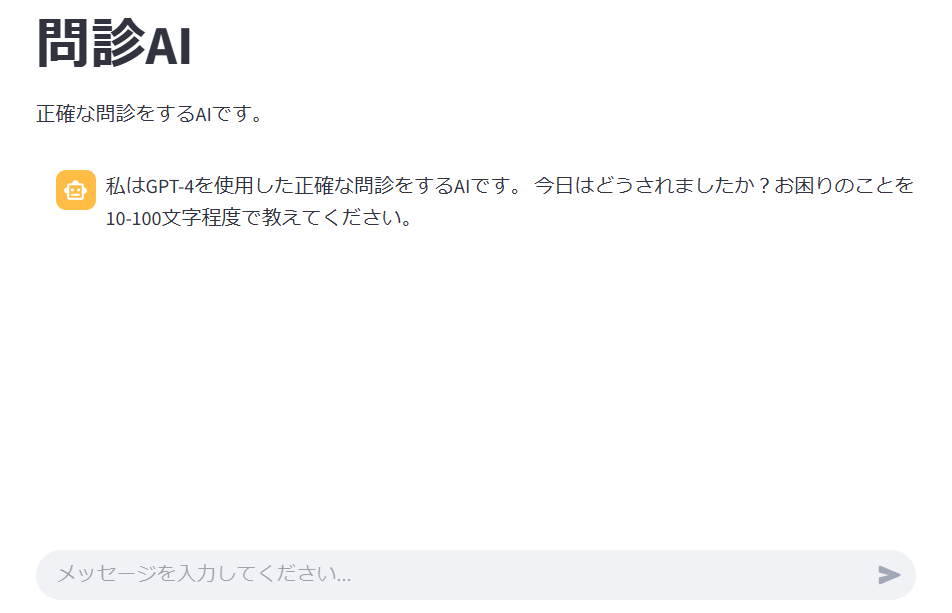

# 問診AI

streamlitによる直感的なUI作成


## 概要

## 主な機能

### 1. マルチLLMプロバイダー対応
- vLLM（ローカルLLMサーバー - Qwen 2.5 72B）
- OpenAI（GPT-4 Turbo）
- Google Gemini（Gemini 2.0 Flash Lite）
- Anthropic Claude（Claude 3 Opus）
- Deepseek（Deepseek Chat）

### 2. Webインターフェース (`app.py`)
- Streamlitベースの使いやすいUI


### 1. 必要なパッケージのインストール
```bash
pip install -r requirements.txt
pip install google-generativeai
```

## 使用方法

### A. Webインターフェースでの実行（推奨）

1. Streamlitアプリケーションを起動：
```bash
streamlit run app.py
```

2. ブラウザで以下のURLにアクセス：
```
http://localhost:8501
```

3. Webインターフェースの使用手順：

### B. コマンドライン実行

## データ形式

## 制限事項

Sponsors Sponsorship provided by the LLMATCH program of the Matsuo Laboratory LLM Community. https://linktr.ee/matsuolab_community